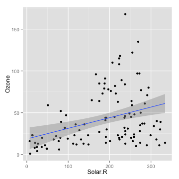

## Introduction to my shiny application

1. It is a simple application using single variable linear regression model to show the relationship between ozone as the outcome and solar radiation, wind and temperature as the predictor respectively in the R built-in airquality dataset. 
2. You can choose which variable to include in your model. 
3. The application will plot your fitted linear regression line and print your model's coefficients.
4. It may take a little while to get the results when you access it online. Just be a little patient! :)

--- .class #id 

## User Interface

1. The UI has two main parts: a sidebar panel and a main panel. 
2. On the sidebar panel on the left side, you can choose which term to include in your model. 
3. On the main panel on the right side, the results will be shown. 

## Server End

1. The server application uses reactive expression to recieve the regressor information and transforms it into a corresponding formula. 
2. It calculates the model, draws the fitted regression line and shows the model's coefficents on the main panel.

--- .class #id

## A Example
- For example, if you choose solar radiation as the regressor, the follwing things will be computed. 


```r
data(airquality)
# Exclude the missing values
na <- sapply(1:nrow(airquality), function(i) {
    any(is.na(airquality[i, ]))
})
data <- airquality[!na, ]
# Get the linear model
fit <- lm(Ozone ~ Solar.R, data = data)
# Draw the fitted regression line
plot <- ggplot(data = data, aes(Solar.R, Ozone)) + geom_point() + geom_smooth(method = "lm") + 
    labs(x = "Solar.R", y = "Ozone")
```


--- .class #id

## The Example Continued

- The following outputs will be shown on the main panel

 

```
##             Estimate Std. Error t value  Pr(>|t|)
## (Intercept)  18.5987    6.74790   2.756 0.0068560
## Solar.R       0.1272    0.03278   3.880 0.0001793
```


